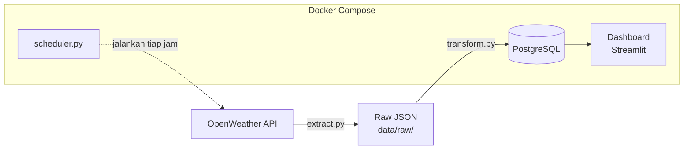
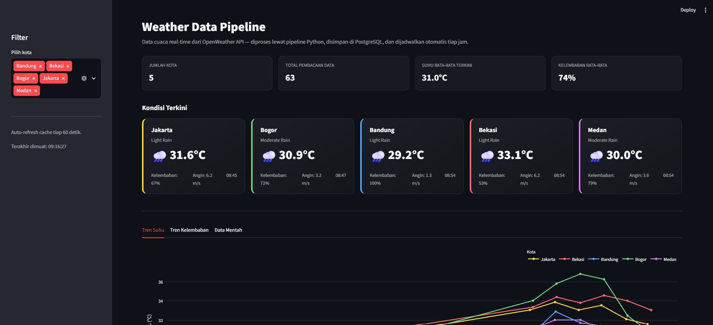

# 🌤️ Weather Data Pipeline

Pipeline data engineering end-to-end: mengambil data cuaca real-time dari
OpenWeather API, memproses dan menyimpannya ke PostgreSQL secara terjadwal
otomatis, lalu memvisualisasikannya lewat dashboard Streamlit — semuanya
berjalan sebagai container Docker yang bisa dinyalakan dengan satu command.

Project ini dibuat sebagai portofolio untuk melamar posisi **Data Engineer**.

---

## Arsitektur



**Alur data:**
1. **Extract** — `extract.py` mengambil data cuaca dari OpenWeather API untuk
   beberapa kota, menyimpannya sebagai file JSON mentah (raw layer) lengkap
   dengan retry logic kalau API gagal/timeout.
2. **Transform & Load** — `transform.py` membaca file JSON mentah tadi,
   melakukan validasi data quality (misal cek suhu dalam rentang wajar),
   lalu memasukkannya ke PostgreSQL. File yang sudah diproses dipindah ke
   folder arsip supaya tidak diproses ulang.
3. **Scheduling** — `scheduler.py` menjalankan siklus extract → transform
   secara otomatis tiap jam, tanpa perlu campur tangan manual.
4. **Visualisasi** — `app.py` (Streamlit) membaca data dari PostgreSQL dan
   menampilkannya sebagai dashboard interaktif: kondisi cuaca terkini per
   kota, serta tren suhu & kelembaban dari waktu ke waktu.

---

## Tech Stack

| Komponen         | Tools                          |
|------------------|---------------------------------|
| Bahasa           | Python 3.12                     |
| Database         | PostgreSQL 16                   |
| Orkestrasi lokal | Docker & Docker Compose         |
| Scheduling       | Python `schedule` library       |
| Visualisasi      | Streamlit, Plotly               |
| Sumber data      | OpenWeather API (Current Weather)|

---

## Struktur Project

```
weather_pipeline/
├── extract.py           # ambil data dari OpenWeather API -> JSON mentah
├── transform.py         # bersihkan data, load ke PostgreSQL
├── scheduler.py         # jalankan extract + transform otomatis tiap jam
├── app.py               # dashboard Streamlit
├── init.sql             # schema database (tabel cities & weather_readings)
├── Dockerfile           # image untuk service pipeline & dashboard
├── docker-compose.yml   # orkestrasi 3 service: db, pipeline, dashboard
├── requirements.txt     # dependency Python
├── .env.example         # contoh file environment variable
└── data/
    ├── raw/             # JSON mentah yang belum diproses
    └── processed/       # JSON yang sudah masuk ke database (arsip)
```

---

## Cara Menjalankan

### Prasyarat
- [Docker Desktop](https://www.docker.com/products/docker-desktop/) sudah terinstall
- API key gratis dari [OpenWeather](https://openweathermap.org/api)

### Setup

1. Clone repo ini, lalu masuk ke foldernya:
   ```bash
   git clone <url-repo-kamu>
   cd weather_pipeline
   ```

2. Buat file `.env` dari contoh yang tersedia:
   ```bash
   cp .env.example .env
   ```
   Isi `OPENWEATHER_API_KEY` di dalamnya dengan API key asli kamu.

3. Buat file `pipeline.log` kosong (dibutuhkan untuk volume mapping Docker):
   ```bash
   touch pipeline.log        # Mac/Linux
   type nul > pipeline.log   # Windows
   ```

4. Jalankan seluruh project:
   ```bash
   docker compose up -d --build
   ```

5. Buka dashboard di browser:
   ```
   http://localhost:8501
   ```

### Command yang berguna

| Command                              | Fungsi                                   |
|---------------------------------------|-------------------------------------------|
| `docker compose ps`                   | Cek status semua container                |
| `docker compose logs -f pipeline`     | Lihat log pipeline secara real-time        |
| `docker compose down`                 | Matikan semua (data tetap aman)            |
| `docker compose down -v`              | Matikan + hapus semua data (reset total)   |
| `docker compose up -d --build`        | Nyalakan ulang setelah mengubah kode       |

---

## Data Quality & Reliability

Beberapa hal yang sengaja dibangun untuk menjaga keandalan pipeline:

- **Retry logic** — kalau API gagal/timeout, script mencoba ulang otomatis
  sebelum menyerah, dengan jeda antar percobaan.
- **Data validation** — record dengan nilai tidak wajar (misal suhu di luar
  rentang -50°C sampai 60°C) otomatis dilewati, tidak masuk ke database.
- **Idempotent processing** — file JSON yang sudah diproses dipindah ke
  folder arsip, sehingga tidak ada risiko data ter-insert dua kali kalau
  `transform.py` dijalankan ulang.
- **Graceful degradation** — kalau satu kota gagal diambil datanya, kota
  lain tetap diproses; kalau satu siklus scheduler gagal, siklus berikutnya
  tetap berjalan sesuai jadwal.
- **Health check** — Docker memastikan PostgreSQL benar-benar siap menerima
  koneksi sebelum service lain (pipeline, dashboard) mulai berjalan.

---

## Screenshot



*Dashboard menampilkan kondisi cuaca terkini per kota (dengan ikon sesuai
deskripsi cuaca dari API) serta tren suhu dari waktu ke waktu, hasil dari
beberapa siklus pipeline yang berjalan otomatis tiap jam.*

---

## Pengembangan Selanjutnya

- Migrasi scheduling dari `schedule` library ke Apache Airflow untuk
  orkestrasi yang lebih robust (retry per-task, monitoring UI, dependency
  antar task yang lebih kompleks)
- Deploy ke cloud (misal AWS/GCP) supaya pipeline berjalan 24/7 tanpa
  bergantung pada komputer lokal menyala
- Tambah lebih banyak kota atau sumber data cuaca sebagai perbandingan